# APuzzle

A collection of grid logic puzzles for Android, Windows, iOS and the web, built with Flutter.
Every puzzle is **generated on the device**, and a solver checks that it has **exactly one solution**.
You choose the grid size and the difficulty.

<p align="center">
  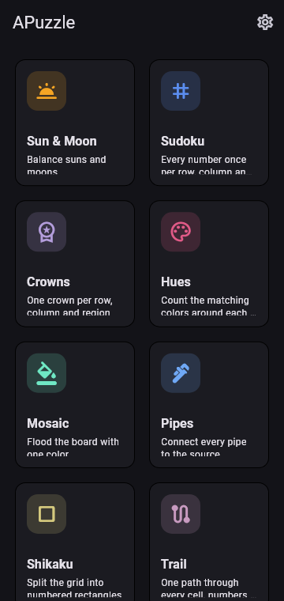
  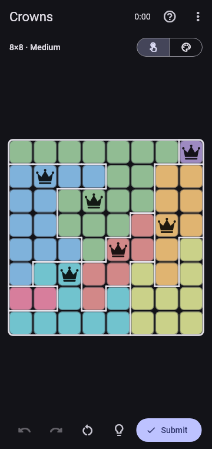
  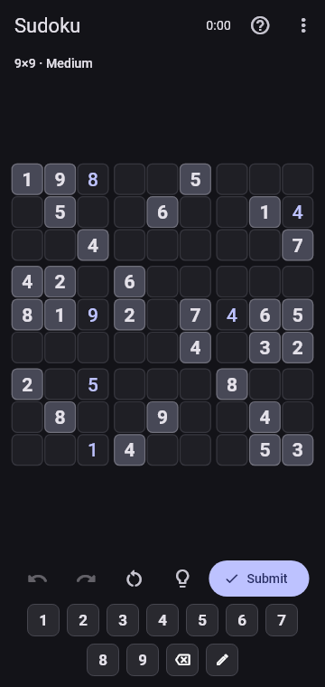
</p>

## Puzzles

| | Puzzle | Goal |
|---|---|---|
| 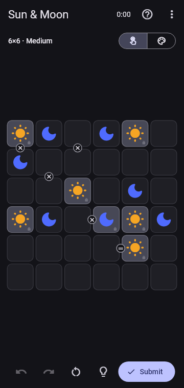 | **Sun & Moon** | Fill every cell with a sun or a moon. No three of the same in a row, equal counts in every row and column, and `=` / `×` clues between cells. |
|  | **Sudoku** | 4×4, 6×6 or 9×9 grids. Every number appears once per row, column and box. Supports pencil marks. |
|  | **Crowns** | Place one crown in every row, column and colored region. Crowns can't touch, not even diagonally. |
| 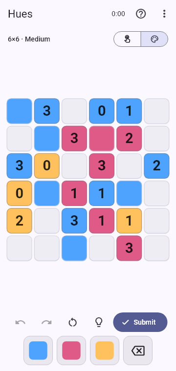 | **Hues** | Color the blank cells. Each number counts the blank cells around it (all 8 neighbors) that end up in its color. |
| 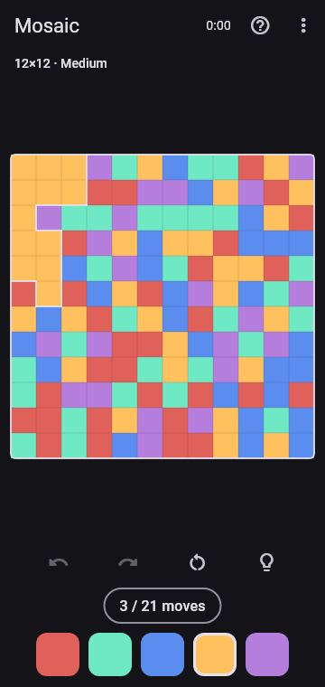 | **Mosaic** | Flood the board with one color from the top-left corner, within the move limit. |
| 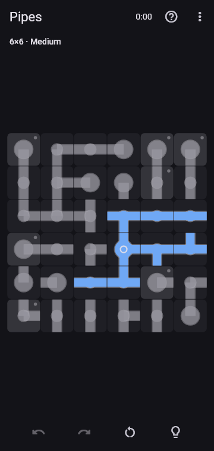 | **Pipes** | Rotate tiles until every pipe connects to the source, with no open ends and no loops. |
| 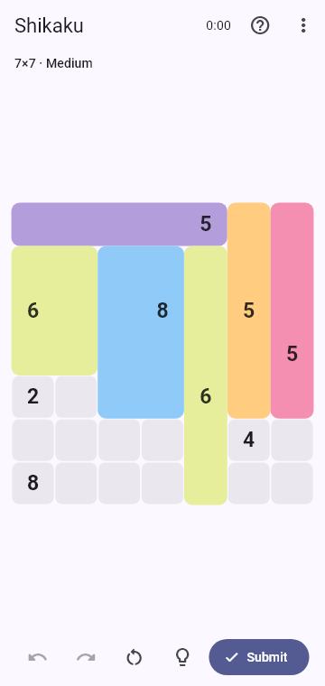 | **Shikaku** | Split the grid into rectangles. Each holds one number equal to its area. |
| 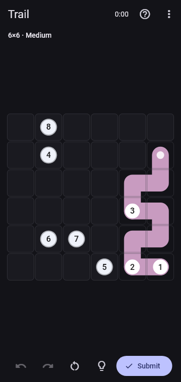 | **Trail** | Draw one path through every cell that passes the numbers in order. |
| 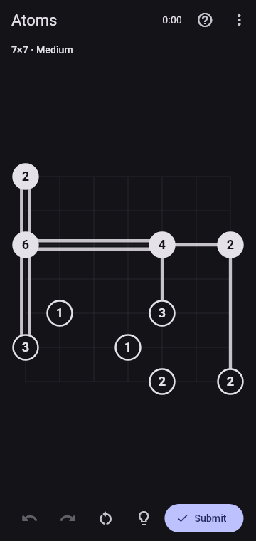 | **Atoms** | Connect atoms with single or double bonds that match their numbers. Bonds can't cross, and all atoms must end up connected. |
| 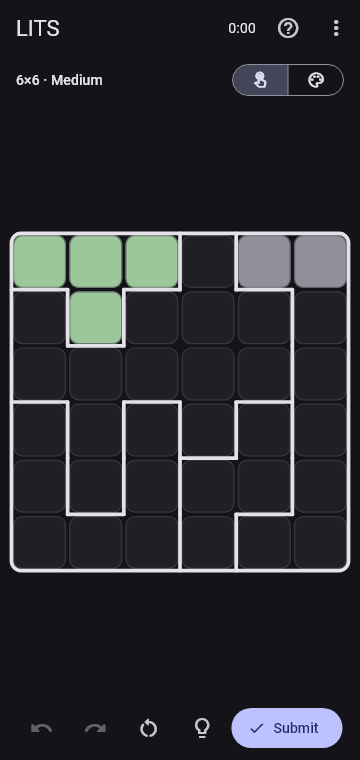 | **LITS** | Shade one L, I, T or S tetromino in every region. The shaded area is connected, with no 2×2 blocks, and identical shapes never touch across region borders. |

## Features

- **Endless puzzles.** Generation is seeded and deterministic, and runs in a background isolate.
- **Exactly one solution.** Most types are also graded by how deep the solver's logic has to go (easy, medium, hard, and expert for Sudoku).
- **Variable grid sizes.** A size is only offered if it fits the screen, so there's no zooming.
- **Two input styles.** Tap a cell to cycle its values, or pick a value from a palette and stamp it. Pencil marks are available where useful.
- **Checked on submit.** Mistakes aren't highlighted while you play; live highlighting is an option in Settings.
- **Undo, redo, restart and hints.** There's a timer, and stats are kept per puzzle and difficulty.
- **Auto-save.** Leave at any time and continue where you stopped.
- **Animations.** Cells pop and fade, pipes rotate, colors flood, and solving plays a ripple with confetti.
- **Light and dark themes** (Material 3).

## Getting started

Requirements:
- **Flutter** stable 3.47 or newer, with Dart 3.13 or newer.
- **Android:** the Android SDK, with licenses accepted via `flutter doctor --android-licenses`.
- **Windows desktop:** Visual Studio 2022 with the *Desktop development with C++* workload, and Windows *Developer Mode* turned on (plugins need symlinks).

```bash
flutter pub get
```

```bash
flutter run -d windows
```

```bash
flutter run -d chrome
```

```bash
flutter build apk --release
```

## Tests

```bash
flutter analyze
```

```bash
flutter test
```

For every puzzle type, the generator tests check the following across sizes, difficulties and seeds:
- the solution is valid;
- the puzzle has exactly one solution;
- it can be solved at its target logic tier;
- generation is deterministic;
- generation is fast.

The screenshots above come from a snapshot harness, which renders every game screen at phone size (dark and light) to `build/snapshots/`:

```bash
flutter test test/snapshots --run-skipped --tags snapshot
```

## Architecture

```
lib/
  core/
    puzzle_type.dart      plug-in contract every puzzle implements
    value_grid.dart       base for "one value per cell" puzzles (input, palette, pencil marks, hints)
    game_controller.dart  session: state history (undo/redo), timer, submit, hints, save/resume, stats
    generator_runner.dart runs generation off the UI thread
    registry.dart         list of available puzzle types
  ui/                     home, new-game sheet, game screen, settings, board widgets
  puzzles/<id>/           model, solver, generator and type for each puzzle
test/                     generator and solver tests per puzzle, controller tests, snapshots
```

To add a puzzle:
1. Create `lib/puzzles/<id>/`.
2. Implement `PuzzleType` (or `ValueGridType` for tap-to-fill grids). This needs:
   - an immutable puzzle and state;
   - a sound solver that can count solutions;
   - a seeded generator.
3. Register the type in `lib/core/registry.dart`.
4. Add tests.

## Status

The Trail and LITS generators are currently limited to 7×7. At larger sizes, proving the solution is unique is still too slow to do on the device.

## License

No license has been chosen yet. All rights reserved until one is added.
